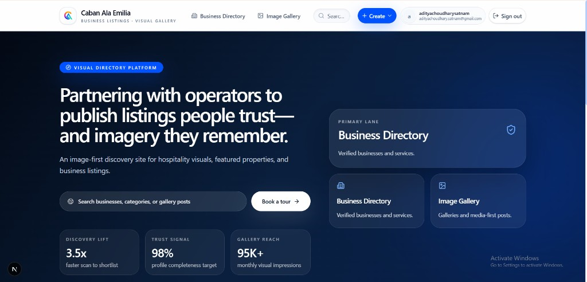
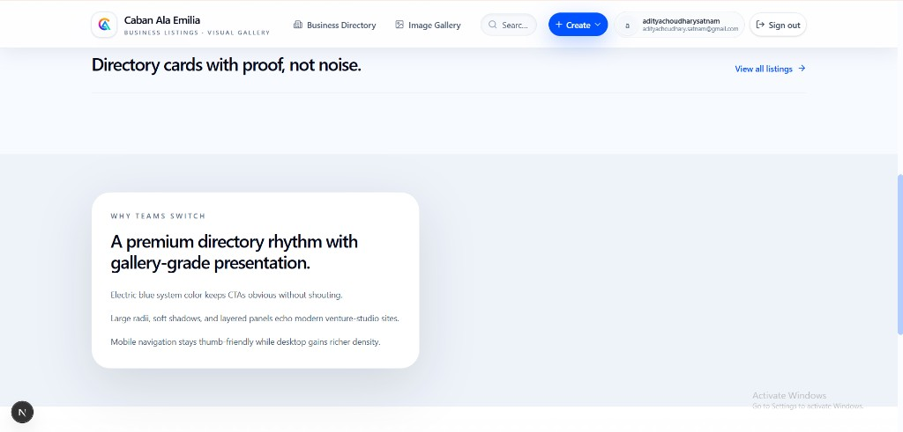
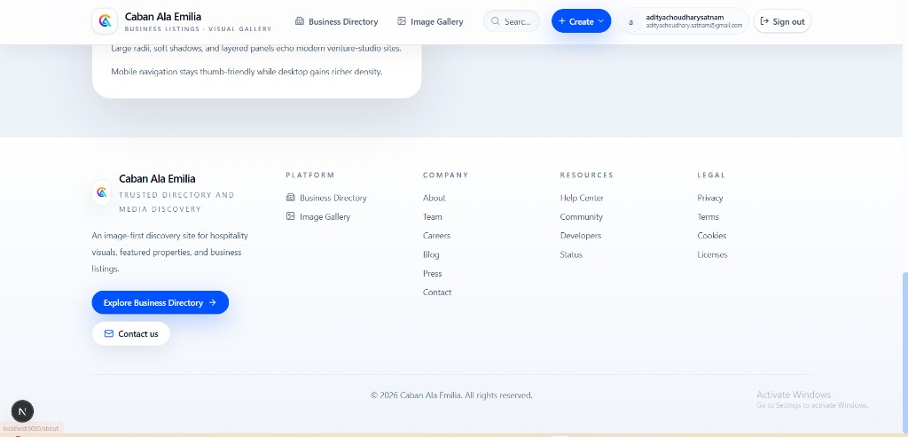
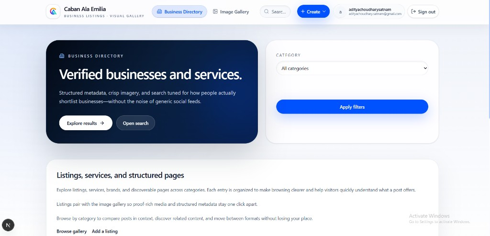
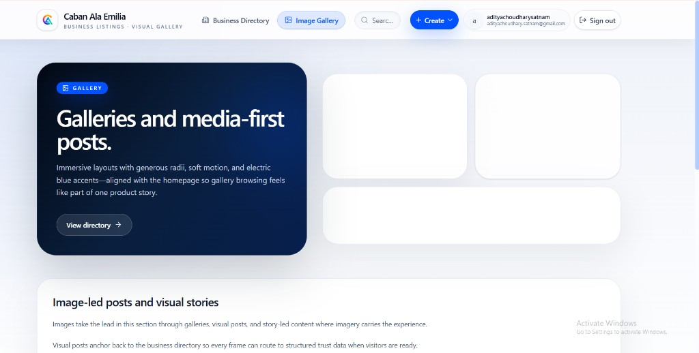
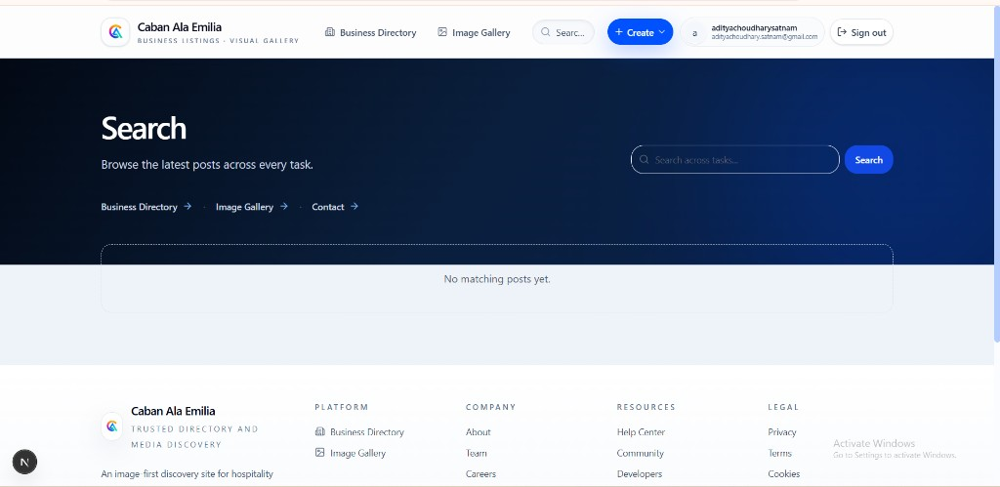
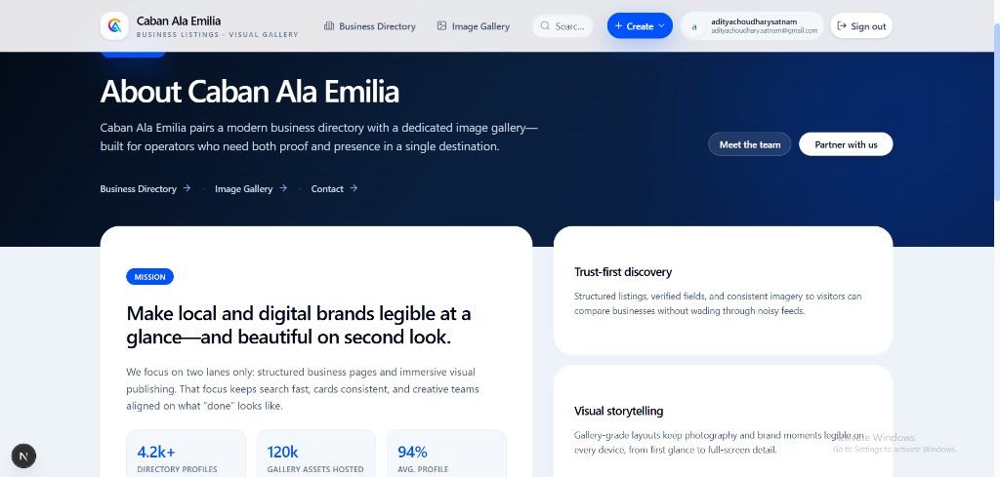

# Caban Ala Emilia

Next.js site: **business directory** and **image gallery** with a navy + electric blue (`#0052ff`) shell, large radii, and shared marketing components.

## UI screenshots

Images are stored in [`docs/screenshots/`](docs/screenshots/) so they render inline on GitHub.

### Homepage



### Directory listings



### Header and footer



### Business directory (filters)



### Image gallery



### Global search



### About



## Local development

```bash
pnpm install
pnpm dev
```

## Production build

```bash
pnpm build
pnpm start
```

VPS deployment notes live in [`deploy/README.md`](deploy/README.md).
